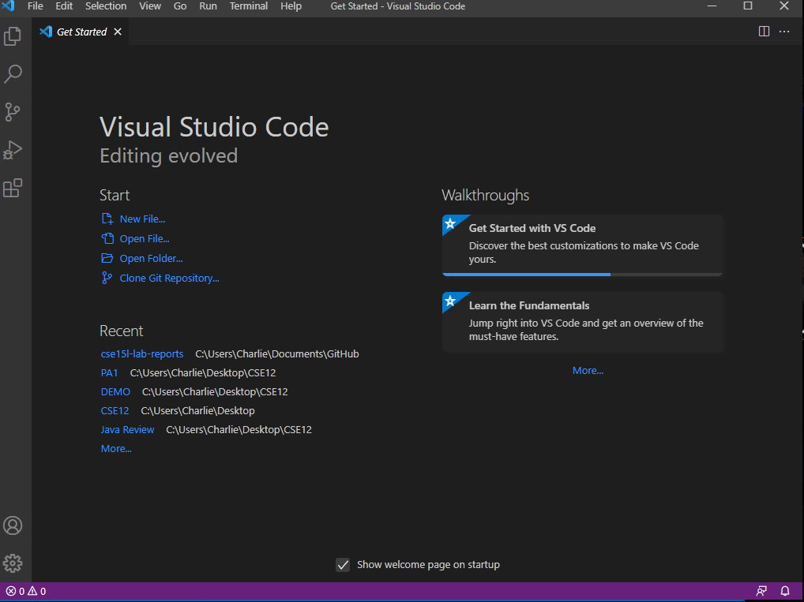
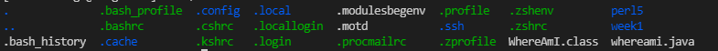
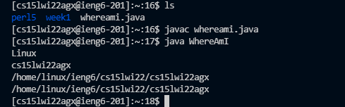
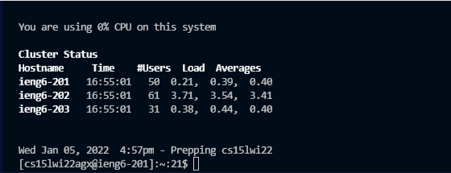
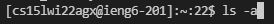

# Week 1: Gaining Remote Access

### **Step 1: Installing VSCode**

Click the link and follow the proper instructions to install Visual Studio Code to your computer. 

https://code.visualstudio.com/


Once installed, the initial pop-up window should look like this. 



### **Step 2: Remotely Connecting with OpenSSH**

*Here, we have assumed that you already have access to your course-specific account for CSE15L.*

Click the link and follow the instructions to install OpenSSH based on your operating system.

[Install OpenSSH](docs.microsoft.com/en-us/windows-server/administration/openssh/openssh_install_firstuse)

Go and open VSCode and open up the terminal and follow the steps using the link below to connect to a remote computer. 

[Connecting to a Remote Computer](https://code.visualstudio.com/docs/remote/ssh#_connect-to-a-remote-host)

```
$ ssh cs15lwi22abc@ieng6.ucsd.edu
```
Replace the "abc" with your course specific account for CSE15L. Once logged in it should look like the picture below. 


### **Step 3: Running some Commands**

Try running some of these basic commands into your terminal:
```
* cd ~
* cd
* ls -lat
* ls -a
```
Running "ls-a" will give you the following prompt: 


### **Step 4: Moving Files using `scp`**

First, create a file on your computer called `WhereAmI.java` and copy-paste the following code:

```
class WhereAmI {
  public static void main(String[] args) {
    System.out.println(System.getProperty("os.name"));
    System.out.println(System.getProperty("user.name"));
    System.out.println(System.getProperty("user.home"));
    System.out.println(System.getProperty("user.dir"));
  }
}
```
In the terminal, run this command:
```
scp WhereAmI.java cs15lwi22abc@ieng6.ucsd.edu:~/
```
You should see here that the OS has changed from Windows to Linux after running the code in the terminal.



### **Step 5: Setting an SSH Key**


Run this to set up your SSH Key:
```
# on client (your computer)
$ ssh-keygen
Generating public/private rsa key pair.
Enter file in which to save the key (/Users/joe/.ssh/id_rsa): /Users/joe/.ssh/id_rsa
Enter passphrase (empty for no passphrase): 
Enter same passphrase again: 
Your identification has been saved in /Users/joe/.ssh/id_rsa.
Your public key has been saved in /Users/joe/.ssh/id_rsa.pub.
The key fingerprint is:
SHA256:jZaZH6fI8E2I1D35hnvGeBePQ4ELOf2Ge+G0XknoXp0 joe@Joes-Mac-mini.local
The key's randomart image is:
+---[RSA 3072]----+
|                 |
|       . . + .   |
|      . . B o .  |
|     . . B * +.. |
|      o S = *.B. |
|       = = O.*.*+|
|        + * *.BE+|
|           +.+.o |
|             ..  |
+----[SHA256]-----+
```

If you are on Windows, follow the extra steps [here](https://docs.microsoft.com/en-us/windows-server/administration/openssh/openssh_keymanagement#user-key-generation).

Afterwards by using the terminal:
```
$ ssh cs15lwi22zz@ieng6.ucsd.edu
<Enter Password>
# now on server
$ mkdir .ssh
$ <logout>
# back on client
$ scp /Users/joe/.ssh/id_rsa.pub cs15lwi22@ieng6.ucsd.edu:~/.ssh/authorized_keys
# You use your username and the path you saw in the command above
```
You should now be able to log in without inputting your password.



### **Step 6: Optimizing Remote Running**

- You can use the up-arrow key to recall previous commands you have ran in the terminal.

*Here, I have used the up-arrow key on the terminal to recall the previous function `ls-a`.*




**You should now be able to remotely access a remote server using your CSE15L account.**


