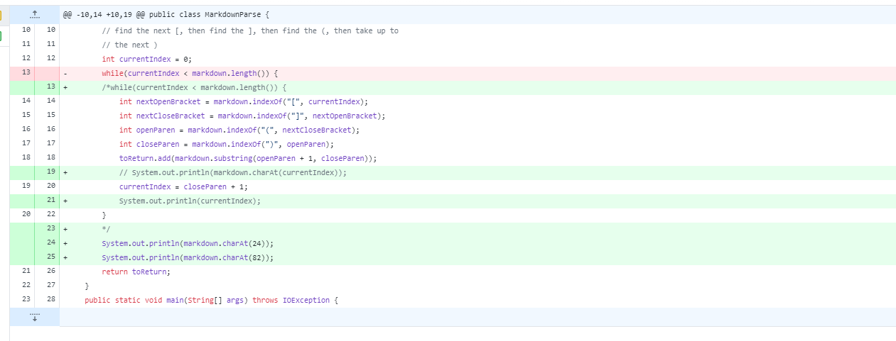
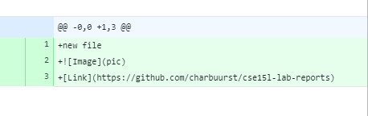
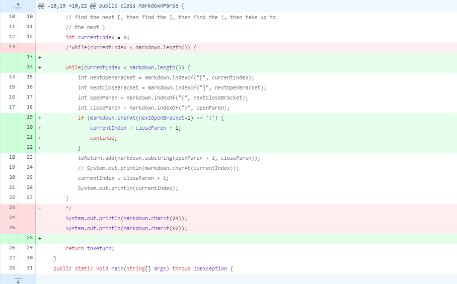

# Week 4 Lab Report

***First code change: Fixing infinite loop:***

Here, we had an infinite loop due to the fact that we had the `System.out.println(currentIndex)` line inside our loop. To fix this, and to print the values 24 and 82, we moved it outside. 

Here, in our `new-file.md`, we see that the space matters in our code, so we got rid of it. Otherwise when we were to print the index, our group members and I got different values. 

We included an *if statement* to see that if our new file started with an exclamation point, our index would be incremented by 1. This was our bug as it wasn't accounting for tester files starting with an image. 

