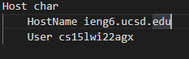
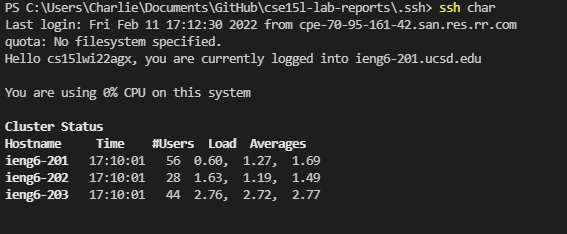

# Week 6 Lab Report

***Streamlining SSH Configuration***

First, I made the `config` file in my `.ssh` directory. There, I edited the text editor to allow me to log into my CS15L account using an alias I chose. Here, I chose my name "char".

Here, I was able to copy files from the remote server onto my new alias. 

