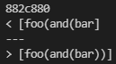
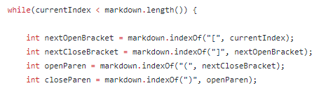
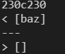

# Lab Report #5 

We were given the option of using the command `diff` to find the differences between our personal implementation of `MarkdownParse` and our Professor's version of `MarkdownParse`.

***We were able to find the differences between my implementation and Joe's implementation of `MarkdownParse`*** using the `diff` command.

For `test-files/495.md`:

The expected outcome for this `test-file` is 
`[foo(and(bar))]`.

In this test, the Professor's implementation was correct. 

Here, the bug occurs simply because the code does not take into consideration the possibility of a parentheses inside the link. To fix this, we would probably need to include some `if statements` to make sure inside the link that there are a second set of parentheses to close off the first set of parentheses. 

### ***Second Difference*** 

For `test-files/201.md`:

Professor's output: `[baz]`

Ours: `[]`

This means that our implementation of `test-files/201.md` is correct, since the expected output to this test file should be `[]`.

